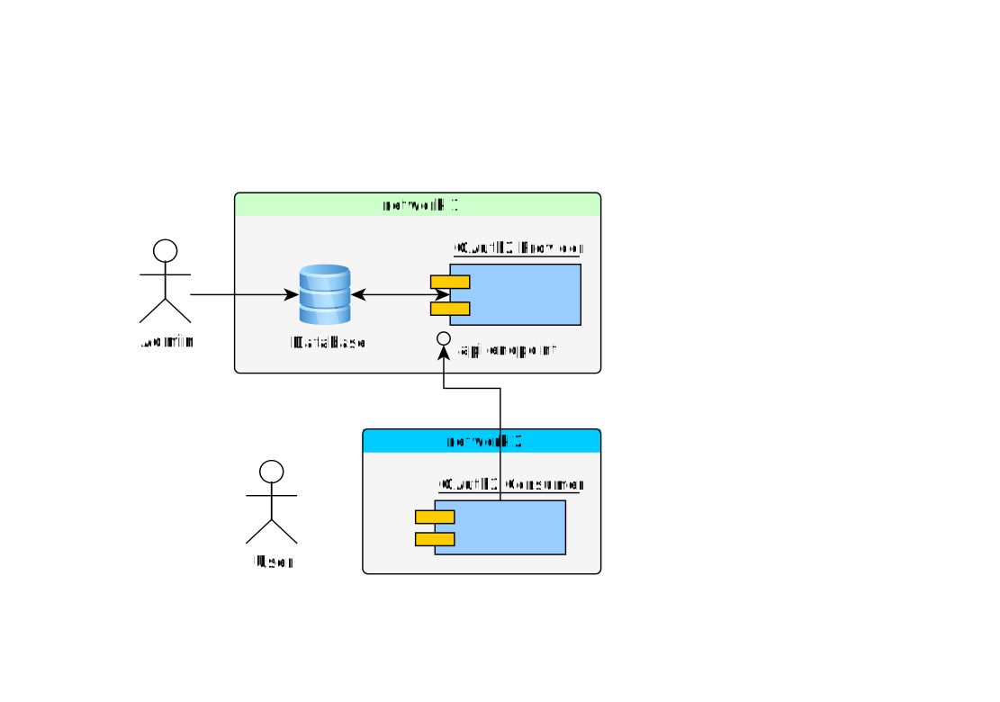

# OAuth2 Solution based on oauth2orize & simple-oauth2 

## Reference

* [OAuth2](http://wiki.li3huo.com/OAuth)
* [oauth2 provider example](https://github.com/gerges-beshay/oauth2orize-examples)
* [oauth2 consumer example](https://github.com/coolaj86/example-oauth2orize-consumer)

## Solution Overview

## Code

### oauth2-provider

An express server provides OAuth2 serivce

Libs in this project:

* express
* express-session
* body-parser
* [commitlint](https://www.npmjs.com/package/commitlint)
* oauth2orize
* [passport](https://www.npmjs.com/package/passport) Express-compatible authentication middleware
* [connect-ensure-login](https://www.npmjs.com/package/connect-ensure-login)
* sequelize

### oauth2-consumer